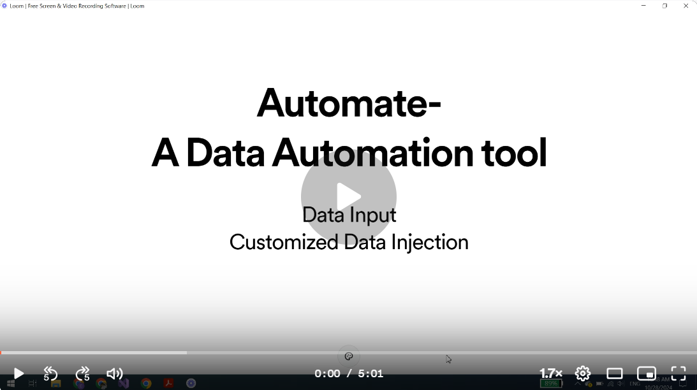

## New Version 

[Link to new version --update 02-11-2025](https://github.com/Cecilia831/WinFormTesseractOCR)

## Automate Readme


###### Usage 
[](https://www.loom.com/share/8b62a5c60a664bc6a173210764f1d31f?sid=06ea64ce-ea5a-4b85-9db5-1e5e862ac45d)
###### Description
This is a project that inject financial data into cloud-based management software Buildertrend.


###### Setup Environment
Go to Command Prompt.
Go to the  following directory and type command:

```
C:\Program Files (x86)\Google\Chrome\Application>chrome.exe --remote-debugging-port=9999 --user-data-dir=C:\Users\lisa\OneDrive\Documents\Chrome_Test
```
This command build a Chrome Driver directory displays besides Automate project.
Log in in the Buildertrend Chrome and go to Summary page.


###### Instructions
1st: Type the data into input.xlsx. Make sure other cells except those projects will be automated are empty.
2nd: Click the Automate Icon then start.


###### Debug
If webpage no respond
----Reopen the spcific Buildertrend Chrome
